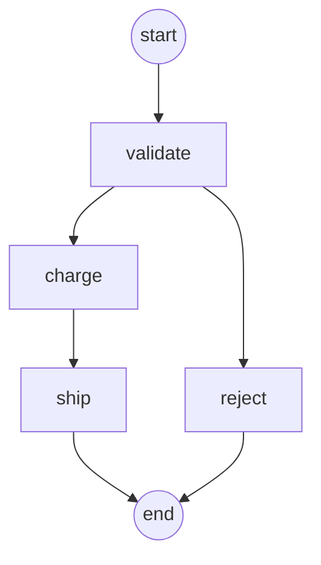

<p align="center">
  <picture>
    <source media="(prefers-color-scheme: dark)" srcset="assets/logo-dark.svg">
    <source media="(prefers-color-scheme: light)" srcset="assets/logo-light.svg">
    
  </picture>
</p>

<h1 align="center">Tsumugi (紡)</h1>

<p align="center">
  A lightweight, type-safe workflow engine you embed in your Rust application.
</p>

<p align="center">
  <a href="https://crates.io/crates/tsumugi"></a>
  <a href="https://github.com/kiwamizamurai/tsumugi/releases/latest"></a>
  <a href="https://docs.rs/tsumugi"></a>
  <a href="https://github.com/kiwamizamurai/tsumugi/actions/workflows/ci.yml"></a>
  <a href="LICENSE"></a>
</p>

> [!CAUTION]
> tsumugi is still in beta and has not yet been published to crates.io. APIs may change before
> the first crates.io release. In the meantime, you can depend on it directly via the git tag —
> see [Installation](#installation).

The name "Tsumugi" (紡) means "to spin" or "to weave" in Japanese.

## Why tsumugi?

Most workflow engines (Airflow, Prefect, Temporal) are **services** that require external databases, message queues, or server processes.

tsumugi is different. It's a **library** you embed directly in your Rust application:

| | tsumugi | Airflow | Prefect | Dagster | Temporal | Argo Workflows |
|--|---------|---------|---------|---------|----------|----------------|
| Type | Library | Platform | Framework | Platform | Platform | K8s CRD |
| Language | Rust | Python | Python | Python | Go + SDKs | Go (YAML) |
| DB required | No | Yes | Yes | Yes | Yes | No |
| Server required | No | Yes | Yes | Yes | Yes | Yes (K8s) |
| UI | Mermaid export | Yes | Optional | Yes | Yes | Yes |

## Features

- **Type-safe state**: Steps operate on your own state type, checked by the compiler. A flexible
  `Context` map with typed keys is available when you need it
- **Ergonomic errors**: Use `?` on any error inside a step; tsumugi records which step failed
  and keeps the original error as the `source`
- **Validated at build time**: Unknown transitions, unreachable steps and duplicate names are
  caught before anything runs
- **Retries, timeouts and hooks**: Exponential backoff, per-step timeouts, `on_success` and
  `on_failure` hooks
- **Observable**: Mermaid diagrams of the workflow and a report of every run
- **Zero infrastructure**: No database, no queue, no server. Three dependencies (`tokio` with
  only the `time` feature, `tracing`, `async-trait`)

## Installation

```toml
[dependencies]
tsumugi = "0.1"
tokio = { version = "1", features = ["macros", "rt-multi-thread"] }
```

Or, until this crate is published to crates.io, depend on the git tag directly:

```toml
[dependencies]
tsumugi = { git = "https://github.com/kiwamizamurai/tsumugi.git", tag = "v0.1.0" }
tokio = { version = "1", features = ["macros", "rt-multi-thread"] }
```

## Quick Start

A workflow is a set of named steps operating on a shared state. Each step decides which step
runs next.

```rust
use std::time::Duration;
use tsumugi::prelude::*;

// 1. The state shared by all steps: any `Send` type.
#[derive(Debug, Default)]
struct Order {
    total: u64,
    payment_id: Option<String>,
}

// 2. Steps are types implementing `Step<State>`...
struct Charge;

#[async_trait]
impl Step<Order> for Charge {
    async fn run(&self, order: &mut Order) -> StepResult {
        if order.total == 0 {
            return Err("nothing to charge".into()); // any error works, `?` included
        }
        order.payment_id = Some(format!("pay_{}", order.total));
        Ok(Next::step("ship"))
    }

    fn retry_policy(&self) -> RetryPolicy {
        RetryPolicy::exponential(3, Duration::from_millis(100))
    }
}

#[tokio::main]
async fn main() -> Result<(), Box<dyn std::error::Error>> {
    // 3. ...or closures. The first step added is the start step.
    let workflow = WorkflowBuilder::<Order>::new()
        .add_step("charge", Charge)
        .then(["ship"])
        .add_fn("ship", |order| {
            println!("shipping order paid with {:?}", order.payment_id);
            Ok(Next::Done)
        })
        .terminal()
        .build()?; // validates names and transitions

    // 4. Run it as often as you like, e.g. once per request.
    let mut order = Order { total: 4_980, ..Default::default() };
    let report = workflow.run(&mut order).await?;
    println!("{}", report);
    Ok(())
}
```

## Steps

### Struct steps

Implement `Step<S>` for a type. Only `run` is required; the other methods configure the step:

```rust,ignore
#[async_trait]
impl Step<Order> for Charge {
    async fn run(&self, order: &mut Order) -> StepResult { /* ... */ }

    // Default: RetryPolicy::none()
    fn retry_policy(&self) -> RetryPolicy {
        RetryPolicy::exponential(3, Duration::from_millis(100)).max_delay(Duration::from_secs(2))
    }

    // Default: Some(30s). Return None to disable.
    fn timeout(&self) -> Option<Duration> {
        Some(Duration::from_secs(10))
    }

    // Called once after the step succeeds. An error fails the workflow.
    async fn on_success(&self, order: &mut Order) -> Result<(), StepError> {
        Ok(())
    }

    // Called once after all retries are exhausted, e.g. for cleanup or compensation.
    async fn on_failure(&self, order: &mut Order, failure: &Failure) {}
}
```

Steps can be generic over any state that provides what they need, so they can be shared across
workflows:

```rust,ignore
#[async_trait]
impl<S: HasHttpClient + Send> Step<S> for Notify {
    async fn run(&self, state: &mut S) -> StepResult { /* ... */ }
}
```

### Closure steps

For small pieces of logic, use closures. Async closures return a boxed future:

```rust,ignore
Workflow::builder()
    .add_fn("check", |ctx| {
        let age = *ctx.require::<u32>("age")?;
        Ok(Next::step(if age >= 18 { "adult" } else { "minor" }))
    })
    .add_async_fn("adult", |ctx| Box::pin(async move {
        ctx.insert("greeting", fetch_greeting().await?);
        Ok(Next::Done)
    }))
```

### Configuring steps at registration

Retry policy and timeout can also be set where a step is added, which takes precedence over the
step's own methods. `retry`, `timeout`, `no_timeout`, `then` and `terminal` apply to the most
recently added step:

```rust,ignore
Workflow::builder()
    .add_step("fetch", Fetch)
    .retry(RetryPolicy::fixed(5, Duration::from_secs(1)))
    .timeout(Duration::from_secs(10))   // or .no_timeout()
    .then(["save"])
```

## State

### Your own type

Any `Send` type can be the workflow state. Every field access is checked by the compiler, so a
step can never read data that another step forgot to write. Use `WorkflowBuilder::<MyState>::new()`
to build a workflow over it.

### `Context`

`Workflow::builder()` uses `Context`, a map that can hold values of any type. It suits loosely
coupled steps, e.g. steps defined in different crates. Declare typed keys to have the compiler
check value types, and use `require` to turn a missing value into an error:

```rust
use tsumugi::prelude::*;

const USER_ID: Key<u64> = Key::new("user_id");

fn step(ctx: &mut Context) -> StepResult {
    ctx.insert(USER_ID, 123);                // ctx.insert(USER_ID, "123") does not compile
    let maybe: Option<&u64> = ctx.get(USER_ID); // no annotation needed
    let id: &u64 = ctx.require(USER_ID)?;    // missing value -> error
    println!("{:?}", id);
    Ok(Next::Done)
}
```

## Transitions

Steps choose what runs next by returning `Next::step("name")` or `Next::Done`. Optionally declare
the possible transitions with `then` and mark end steps with `terminal`:

```rust,ignore
let workflow = Workflow::builder()
    .add_step("validate", Validate).then(["charge", "reject"])
    .add_step("charge", Charge).then(["ship"])
    .add_step("ship", Ship).terminal()
    .add_step("reject", Reject).terminal()
    .build()?;
```

Declared transitions are checked:

- **At build time**: transitions to unknown steps (e.g. typos), steps that can never be reached,
  and duplicate step names are rejected with a `BuildError`.
- **At runtime**: a step returning a next step it didn't declare fails the run.

Declarations are opt-in per step. Undeclared steps may continue anywhere, and loops are allowed.
For compile-time checked step names, implement `From<YourEnum> for StepName`.

## Errors

| Phase | Type | Contains |
|-------|------|----------|
| Inside a step | `StepError` | Any error, converted by `?` |
| `build()` | `BuildError` | What is wrong with the definition |
| `run()` | `ExecutionError` | The failed step, the cause (`ErrorKind`) and the report so far |

```rust,ignore
match workflow.run(&mut state).await {
    Ok(report) => println!("{}", report),
    Err(err) => {
        eprintln!("{}", err);             // step 'charge' failed: gateway returned 402
        eprintln!("{}", err.report());    // what ran before the failure
        if let Some(e) = err.source() { /* the original error, e.g. to downcast */ }
    }
}
```

Both `BuildError` and `ExecutionError` implement `std::error::Error`, so `?` works in functions
returning `Box<dyn Error>` or `anyhow::Result`.

## Visualizing Workflows

`to_mermaid()` renders a workflow as a [Mermaid](https://mermaid.js.org) flowchart that GitHub,
GitLab and many other tools display natively:



Steps without declared transitions are drawn with a dashed border.

## Execution Reports

`run` returns an `ExecutionReport` describing the run:

```text
validate  1 attempt       0.1ms  -> charge
charge    2 attempts     94.1ms  -> ship
ship      1 attempt       0.1ms  done
total: 94.3ms, 1 retry
```

It is also available programmatically via `steps()`, `path()`, `total_retries()` and
`duration()`, e.g. to export metrics.

## Use Cases

Tsumugi is ideal for lightweight, embeddable workflow automation:

| Use Case | Example |
|----------|---------|
| **ETL Pipelines** | Fetch REST API data, transform, export to CSV |
| **Health Monitoring** | Check multiple endpoints, aggregate status, alert |
| **File Processing** | Batch transform logs, convert formats |
| **Data Validation** | Multi-stage validation for CI/CD gates |
| **Notifications** | Multi-channel dispatch (Email, Slack, Webhook) |
| **GitHub Actions** | Scheduled data jobs, report generation |

## Examples

See the [examples](crates/tsumugi/examples/) directory:

### Basic
- [simple_workflow.rs](crates/tsumugi/examples/simple_workflow.rs) - Single-step workflow
- [closure_workflow.rs](crates/tsumugi/examples/closure_workflow.rs) - Closure steps with `Context` and typed keys
- [workflow_graph.rs](crates/tsumugi/examples/workflow_graph.rs) - Custom state type, declared transitions, Mermaid and reports
- [order_workflow.rs](crates/tsumugi/examples/order_workflow.rs) - Multi-step with branching
- [user_scoring_workflow.rs](crates/tsumugi/examples/user_scoring_workflow.rs) - Data processing

### Real-World Patterns
- [etl_api_to_csv.rs](crates/tsumugi/examples/etl_api_to_csv.rs) - REST API to CSV (GitHub Actions friendly)
- [health_check_monitor.rs](crates/tsumugi/examples/health_check_monitor.rs) - Service health monitoring with retries
- [file_processing_pipeline.rs](crates/tsumugi/examples/file_processing_pipeline.rs) - Batch log file aggregation
- [data_validation_pipeline.rs](crates/tsumugi/examples/data_validation_pipeline.rs) - Multi-stage data validation
- [notification_dispatch.rs](crates/tsumugi/examples/notification_dispatch.rs) - Multi-channel notifications

Run examples:

```bash
# Basic
cargo run -p tsumugi --example simple_workflow
cargo run -p tsumugi --example closure_workflow
cargo run -p tsumugi --example workflow_graph
cargo run -p tsumugi --example workflow_graph -- --mermaid

# Real-world patterns
cargo run -p tsumugi --example etl_api_to_csv
cargo run -p tsumugi --example health_check_monitor
cargo run -p tsumugi --example data_validation_pipeline
```

## Documentation

- [API Documentation](https://docs.rs/tsumugi) - Full API reference on docs.rs

## Minimum Supported Rust Version

Rust 1.75.0 or later.

## Contributing

Contributions are welcome! Please feel free to submit a Pull Request.

## License

Licensed under the [MIT license](LICENSE).
