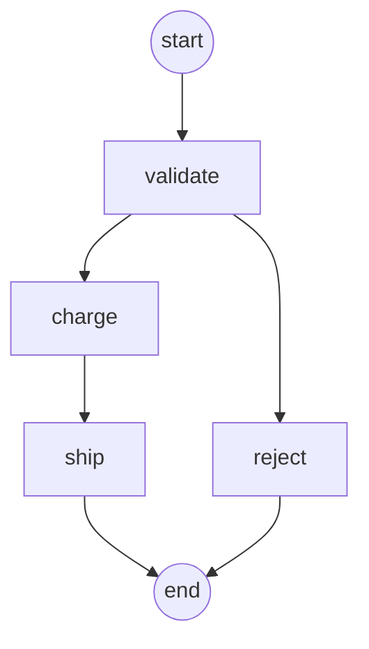

# Tsumugi (紡)

[](https://crates.io/crates/tsumugi)
[](https://docs.rs/tsumugi)
[](https://github.com/kiwamizamurai/tsumugi/actions/workflows/ci.yml)
[](LICENSE)

A lightweight workflow engine for Rust. The name "Tsumugi" (紡) means "to spin" or "to weave" in Japanese.

## Why tsumugi?

Most workflow engines (Airflow, Prefect, Temporal) are **services** that require external databases, message queues, or server processes.

tsumugi is different. It's a **library** you embed directly in your Rust application:

| | tsumugi | Airflow | Prefect | Dagster | Temporal | Argo Workflows |
|--|---------|---------|---------|---------|----------|----------------|
| Type | Library | Platform | Framework | Platform | Platform | K8s CRD |
| Language | Rust | Python | Python | Python | Go + SDKs | Go (YAML) |
| DB required | No | Yes | Yes | Yes | Yes | No |
| Server required | No | Yes | Yes | Yes | Yes | Yes (K8s) |
| UI | Mermaid export | Yes | Optional | Yes | Yes | Yes |

## Features

- **Lightweight**: Minimal dependencies, fast compilation, ~1MB binary
- **Zero Infrastructure**: No database, no message queue, no server process
- **Heterogeneous Context**: Store any type directly without wrapper enums, with optional typed keys
- **Retry & Timeout**: Built-in exponential backoff and per-step timeouts
- **Validated Transitions**: Declare step transitions and catch typos and unreachable steps at build time
- **Mermaid Diagrams**: Render any workflow as a flowchart, no UI server required
- **Execution Reports**: See which steps ran, how long they took and how often they retried

## Installation

```toml
[dependencies]
tsumugi = "0.1"
async-trait = "0.1"
tokio = { version = "1", features = ["full"] }
```

## Quick Start

```rust
use tsumugi::prelude::*;
use async_trait::async_trait;

#[derive(Debug)]
struct HelloStep;

#[async_trait]
impl Step for HelloStep {
    async fn execute(&self, ctx: &mut Context) -> Result<StepOutput, WorkflowError> {
        ctx.insert("message", "Hello, World!".to_string());
        Ok(StepOutput::done())
    }

}

#[tokio::main]
async fn main() -> Result<(), Box<dyn std::error::Error>> {
    let workflow = Workflow::builder()
        .add_step("hello", HelloStep)
        .start_with("hello")
        .build()?;

    let mut ctx = Context::new();
    let report = workflow.execute(&mut ctx).await?;

    // Retrieve typed data from context
    if let Some(message) = ctx.get::<String>("message") {
        println!("{}", message);
    }
    println!("{}", report);
    Ok(())
}
```

## Closure Steps

For small pieces of logic, define steps with closures instead of dedicated structs:

```rust
let workflow = Workflow::builder()
    // Synchronous closure: quick, non-blocking logic
    .add_fn("check", |ctx| {
        let age = ctx.get::<u32>("age").copied().unwrap_or_default();
        Ok(StepOutput::next(if age >= 18 { "adult" } else { "minor" }))
    })
    // Asynchronous closure: wrap an `async move` block with `Box::pin`
    .add_async_fn("adult", |ctx| Box::pin(async move {
        ctx.insert("group", "adult".to_string());
        Ok(StepOutput::done())
    }))
    .add_fn("minor", |_ctx| Ok(StepOutput::done()))
    .start_with("check")
    .build()?;
```

`FnStep` and `AsyncFnStep` implement `Step`, so closures work with every builder method,
including timeouts and retries, and can be mixed freely with struct-based steps:

```rust
let client = Arc::new(ApiClient::new());

let fetch = AsyncFnStep::new("fetch", move |ctx| {
    // The closure runs once per attempt, so clone captured handles first
    let client = Arc::clone(&client);
    Box::pin(async move {
        let data = client.fetch().await.map_err(|e| WorkflowError::StepError {
            step_name: StepName::new("fetch"),
            details: e.to_string(),
        })?;
        ctx.insert("data", data);
        Ok(StepOutput::next("save"))
    })
});

let workflow = Workflow::builder()
    .add_configured("fetch", fetch, StepConfig {
        timeout: Some(Duration::from_secs(5)),
        retry_policy: RetryPolicy::fixed(3, Duration::from_millis(100)),
    })
    .add_step("save", SaveStep)
    .start_with("fetch")
    .build()?;
```

## Heterogeneous Context

The context can store any type that implements `Send + Sync + 'static`:

```rust
// Store different types directly - no wrapper enum needed!
ctx.insert("user_id", 123u64);
ctx.insert("name", "Alice".to_string());
ctx.insert("scores", vec![85.5, 92.0, 78.3]);
ctx.insert("config", MyCustomConfig { ... });

// Retrieve with type inference
let id: &u64 = ctx.get("user_id").unwrap();
let name: &String = ctx.get("name").unwrap();
```

### Typed Keys

Declare keys as constants to have the compiler check value types and drop the annotations:

```rust
const USER_ID: Key<u64> = Key::new("user_id");

ctx.insert(USER_ID, 123);           // ctx.insert(USER_ID, "123") does not compile
let id = ctx.get(USER_ID);          // Option<&u64>, no annotation needed
```

Typed keys and string keys share the same namespace, so you can adopt them gradually.

## Step Output

Steps return `StepOutput` to control workflow flow:

```rust
async fn execute(&self, ctx: &mut Context) -> Result<StepOutput, WorkflowError> {
    // Continue to next step
    Ok(StepOutput::next("next_step"))

    // Or complete the workflow
    Ok(StepOutput::done())
}
```

## Declared Transitions

Optionally declare where each step may go with `then`, and mark end steps with `terminal`:

```rust
let workflow = Workflow::builder()
    .add_step("validate", ValidateStep)
    .then(["charge", "reject"])
    .add_step("charge", ChargeStep)
    .then(["ship"])
    .add_step("ship", ShipStep)
    .terminal()
    .add_step("reject", RejectStep)
    .terminal()
    .start_with("validate")
    .build()?;
```

Declared transitions are checked:

- **At build time**: a transition to a step that doesn't exist (e.g. a typo) fails with
  `UnknownTransitionTarget`, and a step that can never be reached fails with `UnreachableStep`.
  Duplicate step names fail with `DuplicateStep`.
- **At runtime**: a step returning a next step it didn't declare fails with `UndeclaredTransition`.

Declarations are opt-in per step. Undeclared steps may continue anywhere, and unreachable-step
detection is skipped when a reachable step is undeclared. Loops are allowed.

## Visualizing Workflows

`to_mermaid()` renders a workflow as a [Mermaid](https://mermaid.js.org) flowchart that GitHub,
GitLab and many other tools display natively:

```rust
println!("{}", workflow.to_mermaid());
```



Steps without declared transitions are drawn with a dashed border.

## Execution Reports

`execute` returns an `ExecutionReport` describing the run. On failure, the `ExecutionError`
carries the report up to the failing step:

```rust
match workflow.execute(&mut ctx).await {
    Ok(report) => println!("{}", report),
    Err(err) => eprintln!("failed: {}\n{}", err, err.report()),
}
```

```text
validate  1 attempt       0.1ms  -> charge
charge    2 attempts     94.1ms  -> ship
ship      1 attempt       0.1ms  done
total: 94.3ms, 1 retry
```

The report is also available programmatically via `steps()`, `path()`, `total_retries()` and
`duration()`, e.g. to export metrics. `ExecutionError` converts into `WorkflowError` and
`Box<dyn Error>`, so `?` works as usual.

## Optional Traits

Extend step behavior with optional traits:

```rust
// Retry support
impl Retryable for MyStep {
    fn retry_policy(&self) -> RetryPolicy {
        RetryPolicy::exponential_backoff(
            3,                              // max retries
            Duration::from_millis(100),     // initial delay
            Duration::from_secs(5),         // max delay
            2,                              // multiplier
        ).unwrap_or(RetryPolicy::None)
    }
}

// Lifecycle hooks
#[async_trait]
impl WithHooks for MyStep {
    async fn on_success(&self, ctx: &mut Context) -> Result<(), WorkflowError> {
        println!("Step completed!");
        Ok(())
    }

    async fn on_failure(&self, ctx: &mut Context, error: &WorkflowError) -> Result<(), WorkflowError> {
        eprintln!("Step failed: {:?}", error);
        Ok(())
    }
}

// Custom timeout
impl WithTimeout for MyStep {
    fn timeout(&self) -> Duration {
        Duration::from_secs(60)
    }
}
```

## Use Cases

Tsumugi is ideal for lightweight, embeddable workflow automation:

| Use Case | Example |
|----------|---------|
| **ETL Pipelines** | Fetch REST API data, transform, export to CSV |
| **Health Monitoring** | Check multiple endpoints, aggregate status, alert |
| **File Processing** | Batch transform logs, convert formats |
| **Data Validation** | Multi-stage validation for CI/CD gates |
| **Notifications** | Multi-channel dispatch (Email, Slack, Webhook) |
| **GitHub Actions** | Scheduled data jobs, report generation |

## Examples

See the [examples](crates/tsumugi/examples/) directory:

### Basic
- [simple_workflow.rs](crates/tsumugi/examples/simple_workflow.rs) - Single-step workflow
- [closure_workflow.rs](crates/tsumugi/examples/closure_workflow.rs) - Steps defined with closures
- [workflow_graph.rs](crates/tsumugi/examples/workflow_graph.rs) - Typed keys, declared transitions, Mermaid and reports
- [order_workflow.rs](crates/tsumugi/examples/order_workflow.rs) - Multi-step with branching
- [user_scoring_workflow.rs](crates/tsumugi/examples/user_scoring_workflow.rs) - Data processing

### Real-World Patterns
- [etl_api_to_csv.rs](crates/tsumugi/examples/etl_api_to_csv.rs) - REST API to CSV (GitHub Actions friendly)
- [health_check_monitor.rs](crates/tsumugi/examples/health_check_monitor.rs) - Service health monitoring with retries
- [file_processing_pipeline.rs](crates/tsumugi/examples/file_processing_pipeline.rs) - Batch log file aggregation
- [data_validation_pipeline.rs](crates/tsumugi/examples/data_validation_pipeline.rs) - Multi-stage data validation
- [notification_dispatch.rs](crates/tsumugi/examples/notification_dispatch.rs) - Multi-channel notifications

Run examples:

```bash
# Basic
cargo run -p tsumugi --example simple_workflow
cargo run -p tsumugi --example closure_workflow
cargo run -p tsumugi --example workflow_graph
cargo run -p tsumugi --example workflow_graph -- --mermaid

# Real-world patterns
cargo run -p tsumugi --example etl_api_to_csv
cargo run -p tsumugi --example health_check_monitor
cargo run -p tsumugi --example data_validation_pipeline
```

## Documentation

- [API Documentation](https://docs.rs/tsumugi) - Full API reference on docs.rs

## Minimum Supported Rust Version

Rust 1.75.0 or later.

## Contributing

Contributions are welcome! Please feel free to submit a Pull Request.

## License

Licensed under either of:

- Apache License, Version 2.0 ([LICENSE-APACHE](LICENSE-APACHE) or http://www.apache.org/licenses/LICENSE-2.0)
- MIT license ([LICENSE-MIT](LICENSE-MIT) or http://opensource.org/licenses/MIT)

at your option.
